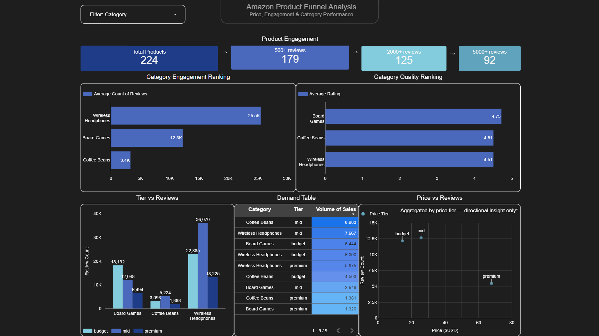

# Amazon Product Funnel Analysis
### Price, Engagement & Category Performance on Amazon.com

**Live dashboard →** [Looker Studio Report](https://datastudio.google.com/s/jJJDPLOT3N8)



---

## Project Overview

This project analyzes Amazon product performance across three categories — board games, coffee beans, and wireless headphones — using a full end-to-end analytics pipeline. The goal is to understand how product pricing, ratings, and review volume influence visibility and engagement, and to identify what separates high-performing products from those that never gain traction.

The analysis simulates a real-world e-commerce analytics workflow: raw API data is extracted, cleaned, transformed, analyzed with SQL, and delivered as an interactive business dashboard.

---

## Tools & Stack

| Layer | Tool | Purpose |
|---|---|---|
| Extraction | Python (requests, pandas) | API pull, JSON flattening, feature engineering |
| Storage & Analysis | Google BigQuery (SQL) | Funnel queries, aggregations, segmentation |
| Visualization | Looker Studio | Interactive dashboard connected live to BigQuery |
| Documentation | GitHub | Portfolio structure, reproducibility |

---

## Project Structure

```
amazon-funnel-analysis/
│
├── data/
│   ├── raw_amazon_products.csv          # Original API pull — never modified
│   └── cleanest_amazon_products_v4.csv  # Final cleaned + feature-engineered dataset
│
├── notebooks/
│   └── 01_data_pipeline_amazon_funnel.ipynb  # API pipeline: extraction → cleaning
│   └── 02_data_final_cleaning.ipynb  # Some final polishes: extra cleaning
├── queries/
│   ├── 01_funnel_analysis.sql
│   ├── 02_category_performance.sql
│   ├── 03_price_analysis/
│   │   ├── 03_price_tier_by_category_CTE.sql     # Final version
│   ├── 04_review_density.sql
│   ├── 05_engagement_stage_analysis.sql
│   └── optional/
│       └── 06_discount_analysis.sql
│       └── 03_price_tier_by_category_legacy.sql  # Prior version kept for reference
└── visuals/
    ├── dashboard_final.png
    ├── categoty_analysis.png
    └── price_tier_view.png
```

---

## Data Pipeline

```
RapidAPI (Axesso Amazon Data)
        ↓
Python / pandas — JSON flattening, cleaning, feature engineering
        ↓
Google BigQuery — SQL funnel queries and aggregations
        ↓
Looker Studio — Live interactive dashboard (connected directly to BigQuery)
```

Data was extracted via the Axesso Real-Time Amazon Data API (RapidAPI) on **19/04/2026**. Three product categories were queried — board games, coffee beans, and wireless headphones — yielding **224 unique product listings** from amazon.com. The raw file is preserved untouched; all transformations were applied to a versioned copy.

---

## Business Questions

1. How do products drop off across engagement levels — from listed to highly reviewed?
2. Do higher-priced products receive more engagement and reviews?
3. Which categories generate the highest review density and visibility efficiency?
4. What does the distribution of product visibility look like — and where is the concentration?
5. Are there identifiable high-performing product tiers, and what do they share?

---

## SQL Queries

| File | Business Question |
|---|---|
| `01_funnel_analysis.sql` | How many products reach each review threshold? Where does drop-off occur? |
| `02_category_performance.sql` | Which categories lead on price, rating, and review engagement? |
| `03_price_tier_by_category_CTE.sql` | How does price tier affect performance within each category? |
| `04_engagement_efficiency.sql` | Which categories convert product visibility into reviews most efficiently? |
| `05_lifecycle_segmentation.sql` | How do products cluster by review maturity — and does it predict quality? |

Each query file includes a comment header stating the business question it addresses.

---

## Key Findings

- **Engagement is heavily concentrated:** the majority of products never surpass 500 reviews, while a small subset dominates with 2000–5000+ — a strong marketplace concentration effect
- **Wireless headphones dominate engagement:** average review count is more than double that of board games and nearly 7x that of coffee beans, indicating stronger purchase urgency and consumer differentiation behavior
- **Price tier effects are category-dependent, not universal:** board games show an inverse relationship (budget products generate more reviews), while coffee beans show a mid-tier sweet spot, and headphones show dominant mid-market preference — there is no single optimal price tier across all categories
- **Coffee beans show passive buyer behavior:** despite reasonable sales volume, review density is the lowest of the three categories — buyers purchase frequently but rarely leave feedback
- **Ratings are stable across tiers:** average rating varies only between 4.4–4.7 across all price tiers and categories, indicating that price does not strongly influence perceived quality — but it does influence engagement and demand volume

---

## Funnel Analysis

The product engagement funnel reveals a strong hierarchical concentration dynamic:

| Stage | Count | Drop-off |
|---|---|---|
| All products | 224 | — |
| 500+ reviews | 179 | −20% |
| 2000+ reviews | 125 | −25% |
| 5000+ reviews | 92 | −15% |

Most products achieve some level of visibility, but sustained high engagement is rare. Getting past the 500-review threshold represents a meaningful market filter — products that cross it show significantly stronger sales volume and rating stability.

---

## Dashboard

**Live dashboard →** [Data(Looker) Studio Report](https://datastudio.google.com/s/jJJDPLOT3N8)

The dashboard is connected directly to BigQuery and reflects live data from the pull date. It includes five analytical panels covering the full funnel, category comparison, price tier segmentation, engagement efficiency, and lifecycle segmentation. A category filter control allows all panels to be sliced simultaneously.


---

## Limitations

- **Single point-in-time snapshot** — Amazon pricing, review counts, and rankings fluctuate continuously; findings reflect one moment rather than a trend
- **BSR (Best Seller Rank) unavailable** via the search endpoint used — this would have been the strongest direct demand signal; the product-level lookup endpoint would be required to retrieve it
- **salesVolume is bucketed, not exact** — "1K+ bought in past month" was parsed to a numeric approximation (1000), meaning demand comparisons are directional rather than precise
- **retailPrice missing for ~55% of records** — discount analysis was limited to a partial subset and moved to the optional queries folder
- **Free API tier capped category depth** — wireless headphones returned only 32 products vs 96 per other category, meaning headphone metrics carry less statistical weight
- **manufacturer and series fields fully empty** — likely gated behind a paid API tier; brand-level analysis was not possible
- **Aggregated dashboard only** — all visuals reflect category or tier averages; product-level outliers and variation are not visible at this view

---

## What Could Be Explored Further

- **Weekly pulls of the same ASINs** to track BSR, price, and review count over time — converting a snapshot into a time-series trend analysis
- **Product-level lookup endpoint** to enrich each ASIN with full BSR and category rank, replacing the review-count proxy with a direct demand signal
- **Expand to 10+ categories** for genuine cross-category benchmarking and to test whether the behavioral patterns observed here hold at scale
- **Predictive engagement model** — given a product's price tier and category, estimate the review threshold trajectory over 6 months using historical Amazon data
- **Seller type segmentation** — does brand vs third-party seller status affect review accumulation rates and pricing strategy?

---

## Notes on Data Integrity

Both the raw and cleaned datasets are preserved in `/data/`. The raw file (`raw_amazon_products.csv`) was never modified after the initial pull. All transformations — null handling, type casting, feature engineering, and derived column creation — were applied to versioned copies and are fully documented in the Jupyter notebook.

---

*Data pulled: [INSERT DATE] · Data source: Axesso Real-Time Amazon Data API via RapidAPI · Dataset: 224 products · Categories: board games, coffee beans, wireless headphones*
